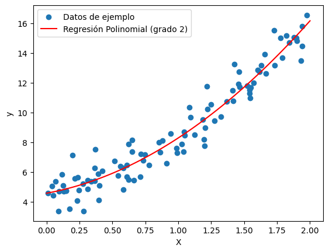

# REGRESIÓN PPLINOMICA 📈

 La regresión polinómica, también conocida como regresión polinomial, es un tipo de análisis de regresión en el que la relación entre la variable independiente (X) y la variable dependiente (Y) se modela utilizando un polinomio de grado n.
 

 ## ¿Cómo funciona la regresión polinómica en Python?

 La forma general de la regresión polinómica es:

 Y=β 
0
​
 +β 
1
​
 ⋅X+β 
2
​
 ⋅X 
2
 +…+β 
n
​
 ⋅X 
n
 +ε

 ## ¿Cuándo utilizar la regresión polinómica✅?

 La regresión polinómica es útil cuando la relación entre las variables no puede describirse adecuadamente mediante una línea recta. Al introducir términos polinómicos, el modelo puede capturar mejor patrones más complejos en los datos.
 

 ## RESUMEN 📈

 En la práctica, ajustar un modelo de regresión polinómica implica encontrar los coeficientes 
�
0
,
�
1
,
�
2
,
…
,
�
�
β 
0
​
 ,β 
1
​
 ,β 
2
​
 ,…,β 
n
​
  que minimizan la diferencia entre los valores predichos por el modelo y los valores reales en los datos observados. Esto puede hacerse utilizando métodos matemáticos o mediante algoritmos de aprendizaje automático.